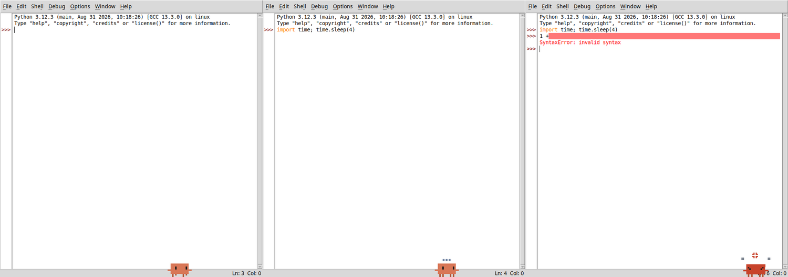
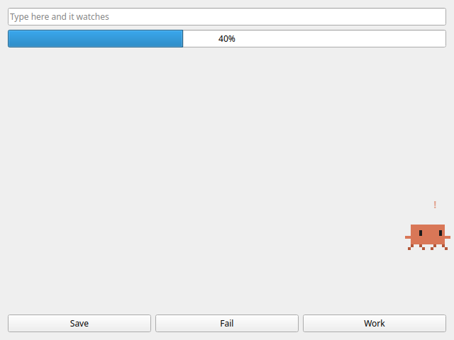
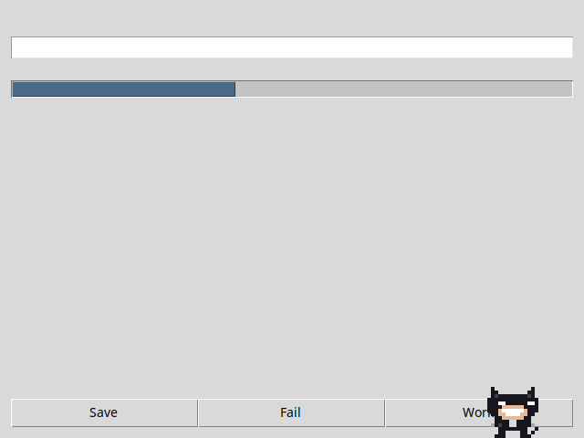
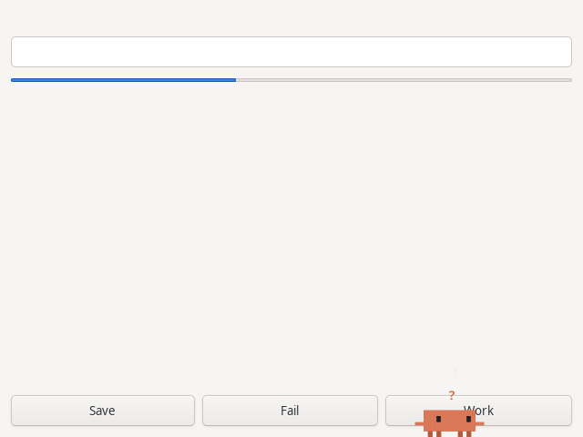
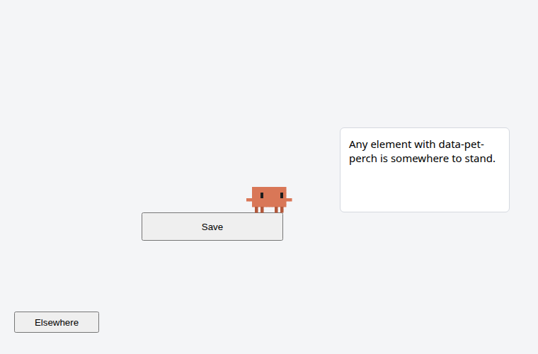

# desktop-pet-skill

**A Claude skill that moves a living pixel pet into any app you have the source of.**

The pet stands on the app's own buttons and fields, walks along them, jumps from one to
another, stalks and rides the cursor, can be picked up and thrown, falls asleep when you
stop moving the mouse, watches you type -- and shows the app's moods: thinking while a job
runs, cheering when it succeeds, fuming at an error.



<sub>IDLE -- Python's own Tk editor -- after the skill added the pet to it: it walks the
window, shows three dots while code runs, and turns red at a `SyntaxError`. Three files
copied in, one place to attach it and four hooks -- the whole change is
[`examples/idle/pyshell.patch`](examples/idle/pyshell.patch).</sub>

It started as the companion in [OFIR](https://github.com/louzinio/ofir-project), an atomic
clock test bench, and comes with both of its skins: **Clawd** and the cat **Amir Latex**.

## Install

As a Claude Code plugin:

```
/plugin marketplace add louzinio/desktop-pet-skill
/plugin install desktop-pet@desktop-pet-skill
```

Or copy `skills/desktop-pet/` into `~/.claude/skills/` (for you) or `.claude/skills/` in a
project (for everyone working on it).

Then, in the app's repository:

> add the desktop pet to this app

> put the cat from the desktop-pet skill in our GTK app, and make it angry when a sync fails

Claude finds the toolkit and the main window, copies the pet in, attaches it, wires a few
of the app's own events to its feelings, and runs the app to show you it working.

## Where it runs

| Toolkit | How | Tested here |
| --- | --- | --- |
| Qt from Python -- PySide6, PyQt6, PySide2, PyQt5 | ready adapter, `WindowPet` | PySide6, PyQt6, PyQt5: lands on a button, clicks beside it reach the app, a press picks it up |
| Tkinter, ttk, customtkinter | ready adapter, `TkPet` | on X11, plus IDLE above |
| GTK 3 from Python | ready adapter, `GtkPet` | on X11 with real mouse clicks (xdotool) |
| Web pages, Electron, Tauri | ready adapter, `attachPet()` | in Chromium |
| C++ Qt/QML, GTK 4, Swing, JavaFX, wx, Flutter, .NET, egui, Fyne, terminal UIs | recipe in `references/toolkits.md` + a port of the core | the port is checked against the reference trace |

The Python adapters need Python 3.10 or newer; the web one, any current browser.

The pet lives **inside** the app's window, so it works the same on X11, Wayland, Windows
and macOS -- Wayland does not let an app place windows of its own, and this never needs
to. (Qt also offers `DesktopPet`, which roams the whole screen, for X11, Windows and macOS.)

| Qt | Tk | GTK 3 | Web |
| --- | --- | --- | --- |
|  |  |  |  |

## How it is built

```
skills/desktop-pet/
  SKILL.md                      what Claude follows
  references/                   the core's API, recipes per toolkit, how to port
  assets/python/desktop_pet/    core.py (no dependencies) + qt.py, tk.py, gtk.py
  assets/js/                    pet-core.js (the same core) + pet-dom.js
  assets/reference_trace.json   4,400 scripted steps, two skins, every state recorded
  scripts/detect_toolkit.py     which toolkit an app uses, and where its window is made
  scripts/make_trace.py         builds the trace, or checks a (vendored) core against it
  scripts/check_js_core.mjs     replays the trace through the JavaScript core
```

All the behaviour -- walking, jumping, pouncing, riding the cursor, sleeping, feelings,
the optional skits -- is one core with no dependencies. An adapter only tells it where the
ledges, the cursor and the window edges are, ~60 times a second, and draws what it returns.

The JavaScript core is a line-for-line port of the Python one, and both reproduce the same
reference trace step for step: same seed, same world, same pet. That trace is also how a
port to C++, Rust, Java or anything else proves it behaves exactly like the original.

## Tests

```bash
pytest tests/test_core.py                             # the core and the trace
node --test tests/js/trace.test.mjs                   # the JavaScript core, same trace
QT_QPA_PLATFORM=offscreen pytest tests/test_qt.py     # DESKTOP_PET_QT=PyQt6 / PyQt5 for the others
xvfb-run -a python3 -m pytest tests/test_tk.py tests/test_gtk.py
pytest tests/test_web.py                              # needs playwright and chromium
```

## Credits

Made by Yonatan Louzon for OFIR, turned into a skill with Claude.
Clawd is the mascot of Anthropic's Claude Code; this project is not affiliated with or
endorsed by Anthropic.

MIT licensed -- see `LICENSE`.
